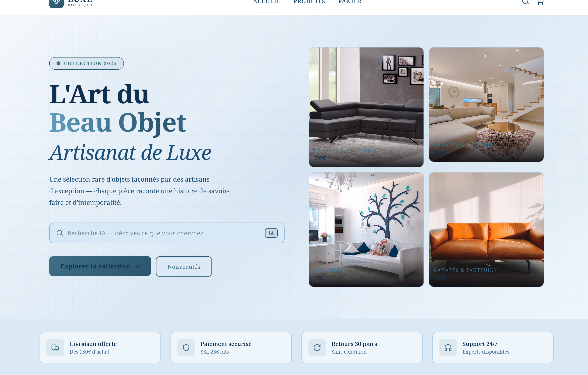
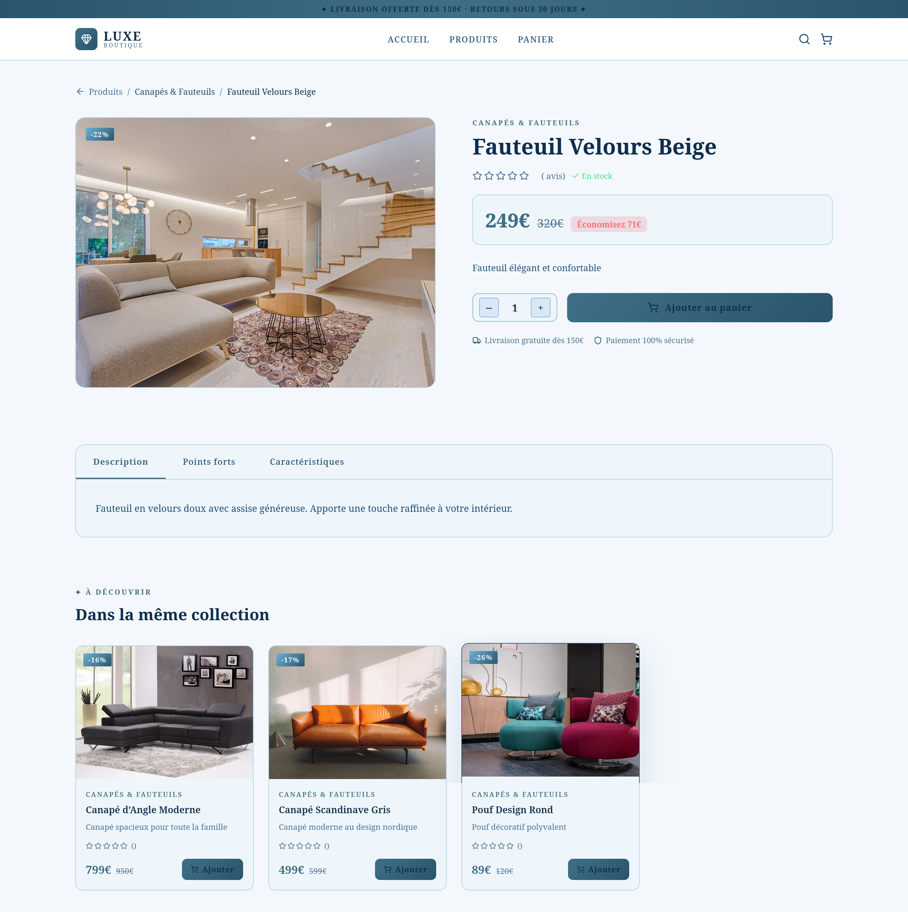
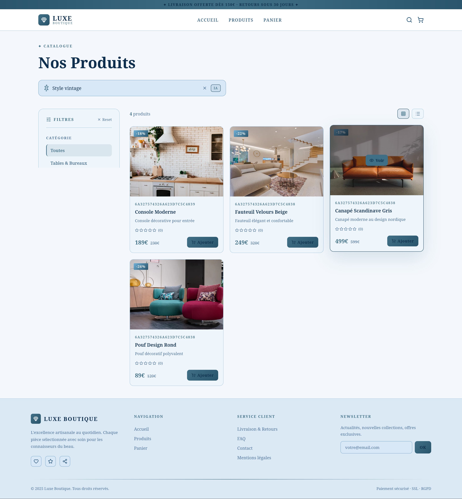
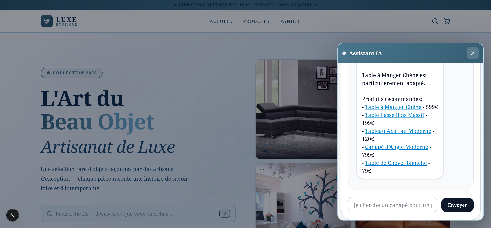

# 🛒 AI-Ecommerce (Fullstack Next.js + Node/Express)

<div align="center">

  
  
  
  
  
  
  
  
  
  

  <p><b>Plateforme e-commerce</b> avec une recherche sémantique, catalogue produits, panier & commandes (backend Node/Express + DB MongoDB, frontend Next.js).</p>

  <p>
    <a href="#-fonctionnalites">✨ Fonctionnalités</a> •
    <a href="#-d%C3%A9marrage-rapide">🚀 Démarrage</a> •
    <a href="#-api-endpoints">🔌 API Endpoints</a> •
    <a href="#-d%C3%A9pannage">🧯 Dépannage</a>
  </p>
</div>

---

## 📸 Aperçu

<table>
  <tr>
    <td align="center">
      
      <br><sub><b>Accueil</b></sub>
    </td>
    <td align="center">
      
      <br><sub><b>Flux d'articles</b></sub>
    </td>
  </tr>
  <tr>
    <td align="center">
      
      <br><sub><b>Recherche vectoriel</b></sub>
    </td>
    <td align="center">
      
      <br><sub><b>Chat bot IA</b></sub>
    </td>
  </tr>
</table>

---

## ✨ Fonctionnalités

### 🧠 Recherche sémantique
- Endpoint dédié `/api/search`
- Recherche sur la base des embeddings (backend)

### 🛍️ Produits
- Liste des produits
- Détail produit par ID
- Données de base disponibles via `frontend/data/products.ts` (fallback en dev)

### 🧾 Commandes
- Création commande
- Récupération commande par ID

### 🧩 Catégories
- Listage des catégories

### 💬 Chat / Chatbot
- Route backend dédiée `/api/chat`

### 💳 Paiement
- Route backend `/api/payment`

### 🔐 Auth
- Routes backend `/api/auth`

---

## 🧱 Tech Stack

- **Frontend**: Next.js (App Router) + TypeScript
- **Backend**: Node.js + Express
- **Base de données**: MongoDB
- **API**: REST

---

## 🚀 Démarrage Rapide

### 1) Backend (Node.js + Express + MongoDB)

```bash
cd backend

# Copier le fichier .env.example et configurer les variables
cp .env.example .env

npm install
```

Variables d’environnement (backend/.env) :

```env
MONGODB_URI=mongodb://localhost:27017/ecommerce
PORT=5000
```

Démarrage :

```bash
# Mode développement (avec nodemon)
npm run dev

# Mode production
npm start
```

Le serveur démarre sur : **http://localhost:5000**

---

### 2) Frontend (Next.js)

```bash
cd frontend

# Copier le fichier .env.example et configurer les variables
cp .env.example .env.local

npm install
```

Variables d’environnement (frontend/.env.local) :

```env
NEXT_PUBLIC_API_URL=http://localhost:5000
```

Démarrage :

```bash
npm run dev
# ou
npm run build && npm start
```

L’application démarre sur : **http://localhost:3000**

---

## 🔌 API Endpoints

Les routes exposées par le backend (Express) :

- **Produits**
  - `GET /api/products` — récupérer tous les produits
  - `GET /api/products/:id` — récupérer un produit par ID

- **Recherche sémantique**
  - `POST /api/search` — recherche sémantique
    - Body: `{ "query": string }`

- **Commandes**
  - `POST /api/orders` — créer une commande
  - `GET /api/orders/:id` — récupérer une commande par ID

- **Catégories**
  - `GET /api/categories` — lister les catégories

- **Chat**
  - `GET/POST /api/chat/*` — endpoints du chat/chatbot (route dédiée)

- **Paiement**
  - `POST /api/payment/*` — endpoints de paiement (route dédiée)

- **Auth**
  - `POST /api/auth/*` — endpoints d’auth (route dédiée)

> Note : certains détails d’entrée/sortie peuvent dépendre des contrôleurs. Pour la liste exacte, tu peux parcourir `backend/src/controllers/` et `backend/src/routes/`.

---

## 🧩 Intégration Frontend ↔ Backend

### Pages/Composants utilisant l’API
- `frontend/app/page.tsx` — page d’accueil (produits featured)
- `frontend/app/products/page.tsx` — liste des produits
- `frontend/app/product/[id]/page.tsx` — détail produit + produits liés
- `frontend/components/SearchBar.tsx` — recherche sémantique

### Fallback (mode développement)
Toutes les pages implémentent un fallback vers `frontend/data/products.ts` en cas d’erreur API.

---

## 🧯 Dépannage

### Connection refused sur port 5000
- Vérifie que le backend est bien lancé :
  - `cd backend` puis `npm run dev`

### MongoDB connection failed
- Vérifie que MongoDB est démarré
- Vérifie `MONGODB_URI` dans `backend/.env`

### Les produits ne se chargent pas
- Vérifie `NEXT_PUBLIC_API_URL` dans `frontend/.env.local`
- Vérifie la console du navigateur
- Vérifie les logs côté backend

---

## 🗺️ Roadmap (idées)

- Paiement Stripe (ou provider équivalent)
- Amélioration du moteur de recherche sémantique
- Amélioration UI/UX du checkout
- Support multi-devices + optimisation performance

---

## 🤝 Contribution

1. Fork le repo
2. Crée une branche : `git checkout -b feature/MaFeature`
3. Commit : `git commit -m "Add: MaFeature"`
4. Push : `git push origin feature/MaFeature`
5. Ouvre une Pull Request

---

## 📄 Licence

Projet sous licence **MIT**.

---

<div align="center">
  Made with 🧠 + 🛠️
</div>

